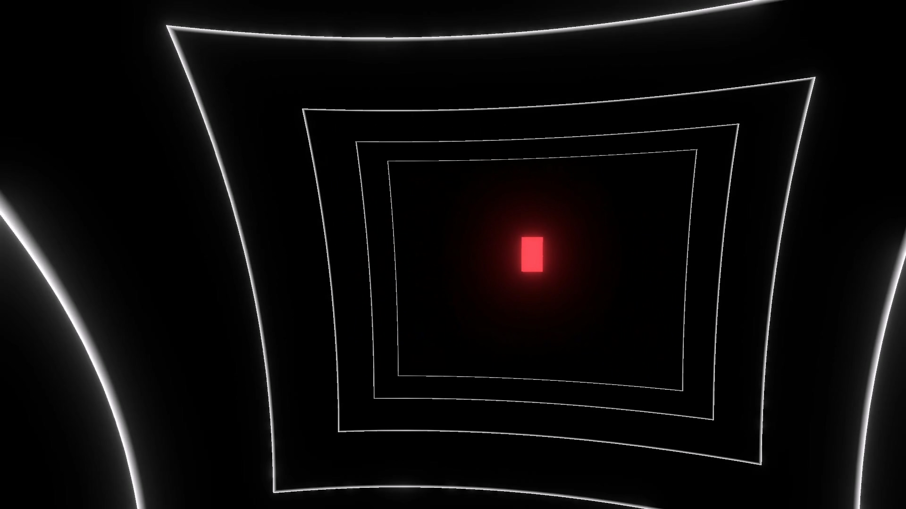
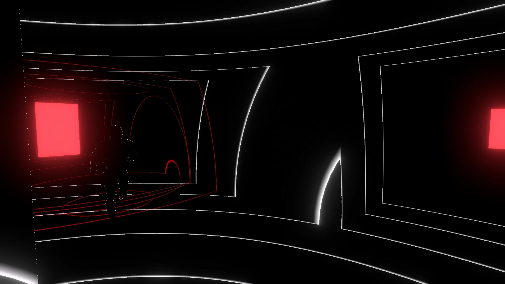

# Ehco

* 제작기간 : 2024.07.01 ~ 2024.08.08

* 개발환경 : Unity , C#

* DownloadLink : https://store.steampowered.com/app/3132180/Echo/
  




# Contribution

* AI
* CinemaScene
  

# CinemaScene


# AI

 
<details>
<summary>BehaviorTree코드샘플</summary>
  
```cs
  
public class BehaviorTree : MonoBehaviour
{
    //트리의 루트 노드는 항상 브런치노드에서 파생 되어야함
    public BranchNode rootNode;
    private bool isRun = true;
    public void RunTree()
    {
        if(isRun)
        rootNode.Tick();
    }

    public void ChangeTreeState()
    {
        rootNode.currentChild = 0;
        isRun = !isRun;
    }
    public bool GetRunState()
    {
        return isRun;
    }

}

```

</details>
 
<details>
<summary>트리노드코드샘플</summary>
  
```cs

//behaviortree를 사용하기위해서 이 이넘값을 리턴해야만 사용가능
public enum ReturnCode { FAILURE, SUCCESS, RUNNING };

//노드는 따로 스크립트로 만들 필요가 없기 때문에 기본클래스로 생성
public class BaseNode 
{
    // Start is called before the first frame update

    public virtual ReturnCode Tick()
    {
        return ReturnCode.SUCCESS;
    }

}


```

```cs

//분기를 나눌 수 있는 노드는 이 노드를 파생하여 사용해야한다
public class BranchNode : BaseNode
{

    public int currentChild;
    public List<BaseNode> childList;


    public override ReturnCode Tick()
    {
        return ReturnCode.SUCCESS;
    }

    public BranchNode()
    {
        childList = new List<BaseNode>();
    }

}

```

```cs

public class SelectNode : BranchNode
{

    public override ReturnCode Tick()
    {

        int icur = currentChild;
        int iListSize = childList.Count;

        for (int iSize = icur; iSize < iListSize; ++iSize)
        {
            ReturnCode State = childList[iSize].Tick();

            currentChild = iSize;

            //이번 틱에서 액션이 성공했고 끝나지 않았다면 
            //다음 틱에서 이어서 실행하기위함
            if (State == ReturnCode.RUNNING)
            {
                return ReturnCode.RUNNING;
            }
            //셀렉터의 자식이 성공적으로 끝났다면 다음 틱에서 셀렉터의 첫 번째 부터 시작
            else if (State == ReturnCode.SUCCESS)
            {
                currentChild = 0;
                return ReturnCode.SUCCESS;
            }

        }

        currentChild = 0;
        return ReturnCode.FAILURE;
    }
}

```

```cs

//자식이 실패한경우 이 노드는 전부 실패처리
public class SequenceNode : BranchNode
{
    public override ReturnCode Tick()
    {
        int icur = currentChild;
        int iListSize = childList.Count;

        for (int iSize = icur; iSize < iListSize; ++iSize)
        {
            ReturnCode State = childList[iSize].Tick();

            currentChild = iSize;
            //이번 틱에서 액션이 성공했고 끝나지 않았다면 
            //다음 틱에서 이어서 실행하기위함
            if (State == ReturnCode.RUNNING)
            {
                return ReturnCode.RUNNING;
            }
            //시퀀스 자식의 컨디션체크가 실패 한 경우 시퀀스를 실패처리
            //다음에 시퀀스에 들어오면 0번 자식부터 실행하기 위함
            else if (State == ReturnCode.FAILURE)
            {
                currentChild = 0;
                return ReturnCode.FAILURE;
            }

        }
        currentChild = 0;
        return ReturnCode.SUCCESS;
    }
}

```

```cs

//노드가 실행 될 수 있는지 확인하는 함수, 컨디션확인

public class DecoratorNode : BaseNode
{
    public Func<ReturnCode> condition;


    public override ReturnCode Tick()
    {
        return condition();
    }

    public DecoratorNode(Func<ReturnCode> condition)
    {
        this.condition = condition;
    }

}
```

```cs
public class TaskNode : BaseNode
{

    [SerializeField]
    public Func<ReturnCode> action;


    public override ReturnCode Tick()
    {
        return action();
    }
    public TaskNode(Func<ReturnCode> action)
    {
        this.action = action;
    }
}

```

</details>


* Tree Sequence


플레이어가 가까운 거리내에 위치한다면 플레이어를 잡는 시퀀스입니다.
<details>
<summary>GrabPlayer샘플</summary>]

```cs

public ReturnCode CheckDistanceToGrab()
{
    //플레이어가 일정거리내에 들어오면 잡는다.
    float dist = Vector3.Distance(targetCharacter.transform.position, this.transform.position);
    if (dist <= 2.8)
    {
        return ReturnCode.SUCCESS;
    }
    else
    {
        return ReturnCode.FAILURE;
    }

}

public ReturnCode GrabPlayer()
{
    //잡힌 플레이어의 인풋을 중단
    targetCharacter.CharacterStop = true;

    //잡은 플레이어의 방향을 AI 로 로테이션
    targerCam.transform.DOLookAt(new Vector3(this.transform.position.x,
                                              this.transform.position.y + 4,
                                              this.transform.position.z), 0.5f);
    targetCharacter.transform.transform.DOLookAt(this.transform.position, 0.5f);

    //화면이 점점 검은색으로 바꾸고 ai의 동작을 정지시킴
    fadeOutScene.FadeOut();
    isGrab = true;
    navMeshAgent.speed = 0;
    visiblePlayer = false;
    behaviorTree.ChangeTreeState();

    animator.SetBool("Grab", true);
    //게임 재시작
    Invoke("ResetGame", 2.0f);

    return ReturnCode.SUCCESS;

}

```
</details>

플레이어가 시야범위 내에 위치해 있는경우 플레이어를 추격 하는 시퀀스입니다.
<details>
<summary>ChasePlayer샘플</summary>]

```cs

IEnumerator FindTargetsWithDelay(float delay)
{
    while (true)
    {
        yield return new WaitForSeconds(delay);
        FindVisibleTargets();
    }
}

void FindVisibleTargets()
{

    Vector3 dirToTarget = (targetCharacter.transform.position - transform.position).normalized;

    //  forward와 target이 이루는 각이 설정한 각도 내라면
    if (Vector3.Angle(transform.forward, dirToTarget) < viewAngle / 2)
    {
        float dstToTarget = Vector3.Distance(transform.position, targetCharacter.transform.transform.position);

        // 타겟으로 가는 레이캐스트에 obstacleMask가 걸리지 않으면
        if (!Physics.Raycast(transform.position, dirToTarget, dstToTarget, obstacleMask) && dstToTarget <= viewRadius)
        {
            lastSeenPos = targetCharacter.transform.position;
            visiblePlayer = true;
        }
        else
        {
            visiblePlayer = false;
        }
    }

}

 public ReturnCode MoveToPlayer()
 {
     //플레이어가 시야에 있는경우 플레이어를 추격
     //시야에서 사라진경우 마지막 위치까지 추격
     navMeshAgent.speed = 6.5f;
     float dist = Vector3.Distance(targetCharacter.transform.position, this.transform.position);
     float last = Vector3.Distance(lastSeenPos, this.transform.position);
     if (dist <= 2.6 || last <= 2.6)
     {

         return ReturnCode.SUCCESS;
     }
     else if (!visiblePlayer)
     {
         navMeshAgent.SetDestination(lastSeenPos);
         return ReturnCode.RUNNING;
     }
     else
     {
         navMeshAgent.SetDestination(targetCharacter.transform.position);
         return ReturnCode.RUNNING;
     }
 }

```

</details>


시야범위 내에 없다면 랜덤한 위치를 순찰하는 시퀀스 입니다.

<details>
<summary>Patrol샘플</summary>]

```cs
void FindPatrolLocation()
{

    //플레이어 기준 랜덤생성
    //if (RandomPoint(targetCharacter.transform.position , patrolRange, out patrolPoint))
    // {
    //     patrolLocation.position = patrolPoint;
    // }

    //완전 무작위
    if (RandomPoint(transform.position, patrolRange, out patrolPoint))
    {
        patrolLocation.position = patrolPoint;
    }
}
//ai가 순찰 시 랜덤한 위치를 선택하는 함수
//범위가 넓어 위치가 찍히지 않는다면 루프횟수를 늘려보거나 SamplePosition 함수에서 maxdistance를 늘려보자
bool RandomPoint(Vector3 center, float range, out Vector3 result)
{
    for (int i = 0; i < 50; i++)
    {
        Vector3 randomPoint = center + Random.insideUnitSphere * range;
        NavMeshHit hit;
        if (NavMesh.SamplePosition(randomPoint, out hit, 5.0f, NavMesh.AllAreas))
        {
            result = hit.position;
            return true;
        }
    }
    result = targetCharacter.transform.position;
    return true;
}

```

</details>


